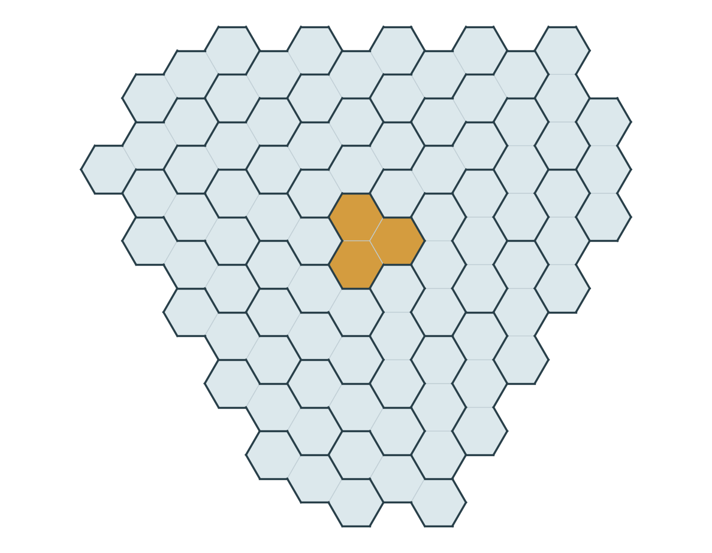

# A centered stone and three rotating bands

*KokunoYumeto — Benzel workbench — 19 September 2026*

The most approachable result in this work is a concrete infinite family: a benzel can be tiled by a single right stone at its center and straight bones arranged with threefold rotational symmetry. The construction specifies every bone. Its proof explains why the bones fit, why they do not overlap, and why their only uncovered cells form the central stone. This is a specialization of the larger residual-and-repair construction, with an additional placement and symmetry property. [T6, §§2–5; PC, lines 5–28]

## Why this result is being presented

The project began by pursuing Propp’s Problem 7, initially unaware of an earlier full-solution claim by Akshat Sharma, submitted on 8 September 2026. When that claim came to attention, the recorded decision was to finish and examine the construction already under development. The resulting work presents an explicit construction and its validation, with no claim of first priority. The [MathDB problem record](https://mathdb.com/p/405267/existence-of-benzel-tilings-with-nonnegative-conway-lagarias) labels Sharma’s submission claimed solved and independently unverified. [S; PV, line 5; T10, lines 25–29]

[Propp’s Problem 7](https://arxiv.org/html/2206.06472v4) asks whether a nonnegative Conway–Lagarias invariant suffices to tile an admissible benzel using right stones and the three orientations of straight bones, with no left stones. The large construction in the workbench addresses its residue-zero family. Completing the full problem’s three congruence classes also uses the published generalized-compression theorem discussed below. The centered theorem can be understood without that dependency. [P; AR, §8; T6, §§2–4]

## The cells and the theorem

A cell has integer coordinates \((x,y)\). Equivalently, its barycentric coordinates are \((x,y,1-x-y)\), whose sum is one. Define

\[
u=y-x,\qquad v=1-x-2y,\qquad w=2x+y-1.
\]

The benzel \(V(a,b)\) consists of the cells for which each of \(u,v,w\) lies between \(1-a\) and \(b-1\), inclusive. This is the original cell region, expressed in two coordinates. A right stone is

\[
R(x,y)=\{(x,y),(x+1,y),(x,y+1)\}.
\]

A bone is a set of three consecutive cells in one of the directions \((1,0),(0,1),(1,-1)\). Write \(H(x,y)\) for the horizontal bone starting at \((x,y)\). A tiling is a partition of the region into these actual three-cell sets. [T10, lines 33–48; P, §§1–2]

**Centered-one-stone theorem.** Let \(d\ge3\) be an integer, set

\[
t_d=\frac{d(d-1)}2,\qquad h=t_d-1,
\]

and let

\[
W_h(d)=V(d+3h,2d+3h)
=V\!\left(\frac{3d^2-d-6}{2},\frac{3d^2+d-6}{2}\right).
\]

There is an explicitly specified tiling of \(W_h(d)\) with exactly one right stone, namely \(R(0,0)\), and exactly \(3h(h+d)\) bones. The whole tiling is invariant under the order-three rotation

\[
\rho(x,y)=(y,1-x-y).
\]

The theorem is the \(h=t_d-1\) family of the written band-packing proof. The argument below gives a shorter route to its central-stone conclusion by counting the complement directly. [T6, lines 90–160 and 248–267; PC, lines 21–28]

{width=70%}

## An explicit construction

Let \(r(n)\) be the unique positive integer satisfying

\[
t_{r(n)}<n\le t_{r(n)+1}.
\]

The triangular blocks have lengths \(1,2,3,\ldots\); in particular \(r(2)=2\). For \(1\le y\le2h+d\), define

\[
(L_y,q_y)=
\begin{cases}
(1-2y-r(y+1),\;y),&y\le h,\\
(y-3h-d+1,\;\min(h,2h+d-y)),&y>h.
\end{cases}
\]

Let \(E\) contain the horizontal bones

\[
H(L_y+3j,y),\qquad 0\le j<q_y.
\]

Thus each row is filled by consecutive, disjoint, length-three intervals; when \(q_y=0\), the row contributes no bone. Put \(F(x,y)=(x,1-x-y)\). Take all bones in

\[
\Gamma=F(E)\cup F\rho(E)\cup F\rho^2(E),
\]

and add \(R(0,0)\). Images here mean images of every cell of each placed tile. Both transformations preserve the permitted tile shapes. The formulas are the shift-one case of the retained packing, so they are also a direct recipe for implementing the theorem. [T6, lines 40–55 and 90–100; packing.py, `band` and `packing`]

## Why this is a tiling

First check that the bands stay inside the region. It is convenient to work before reflection, in \(V(2d+3h,d+3h)\), with difference bounds

\[
A=1-2d-3h,\qquad B=d+3h-1.
\]

A prefix-row cell is \((1-2y-r+z,y)\), where \(r=r(y+1)\) and \(0\le z\le3y-1\). Its three differences are

\[
3y+r-1-z,\qquad r-z,\qquad1-3y-2r+2z.
\]

Since \(y+1\le h+1=t_d\), one has \(1\le r\le d-1\). Taking the two endpoints of each expression in \(z\) puts all three differences in \([A,B]\). In a tail row, write \(y=h+\ell\), \(q=\min(h,h+d-\ell)\). The differences are

\[
3h+d-1-z,\qquad d-3\ell-z,\qquad3\ell-3h-2d+1+2z,
\]

for \(0\le z<3q\). The inequalities \(q\le h\) and \(\ell+q\le h+d\) give the same bounds. Rotation preserves the bounds, and reflection exchanges the two benzel parameters. Every displayed bone is therefore contained in \(W_h(d)\). [T6, lines 102–121]

Next check that rotating the sectors does not create overlaps. Every cell in \(E\) has \(y\ge1\) and \(x<y\). A cell common to \(E\) and \(\rho E\) would have \(1\le x<y\), with both \((x,y)\) and \((1-x-y,x)\) in \(E\). If both rows are prefix rows, their row bounds force

\[
r(y+1)\le y-x\le r(x+1).
\]

Monotonicity forces these three integers to equal some \(r\). But \(x+1\) and \(y+1\) would then belong to the same triangular block of length \(r\) while differing by \(r\), which is impossible. If the higher row is a tail and the lower row a prefix, the corresponding inequalities force \(d\le y-x\le d-1\). If both are tails, they force simultaneously \(2x+y\le3h+d\) and \(2x+y\ge3h+d+3\). These exhaust the cases. Rotation gives the same result for the other sector pairs. [T6, lines 123–143]

It remains to identify the uncovered cells. One sector contains

\[
\sum_{y=1}^{h}y+
\sum_{\ell=1}^{h+d}\min(h,h+d-\ell)=h(h+d)
\]

bones. The original region has

\[
|W_h(d)|=3(t_d-h)+9h(h+d)=3+9h(h+d)
\]

cells. The general area formula follows by the explicit three-phase coordinate count in the original proof; each phase has \(\binom{d+3h}{2}-2\binom h2-\binom{h+1}{2}\) cells. Consequently the disjoint packing \(\Gamma\) leaves exactly three cells. [T6, lines 57–88 and 145–155]

Those cells are the central stone. Indeed, \(R(0,0)\) is fixed as a set by both \(F\) and \(\rho\), and its three cells have differences in \(\{-1,0,1\}\), so it is inside the benzel. In \(E\), the only possible central cell is \((0,1)\), since the other central cells have second coordinate zero. But row one has \(L_1=-3\) and \(q_1=1\), so its cells have first coordinates \(-3,-2,-1\). Thus \(E\), and hence each transformed sector, avoids the center. Three missing cells and three uncovered central cells finish the partition proof. This paragraph is a direct specialization of the source formulas; it does not require the general residual-ranking theorem. [T6, lines 19–22, 31, 42 and 95–99]

Finally, \(\rho F=F\rho^2\), so applying \(\rho\) merely permutes the three sectors of \(\Gamma\). The central stone is fixed. This proves the claimed symmetry and completes the theorem. For \(d=3\), \(h=2\), the region is \(V(9,12)\), and the construction has one central stone and 30 bones, covering 93 cells. [PC, lines 21–28; direct substitution in the theorem]

## What the band slides add

The same final tiling also has a constructive explanation in terms of moving vacancies. Start from the shift-zero packing. For \(r=d-2,d-3,\ldots,1\), shift the band

\[
H(1-r^2+3j,t_{r+1})
\quad\longmapsto\quad
H(2-r^2+3j,t_{r+1}),\qquad0\le j<t_{r+1},
\]

and its two rotations. The old interval starts at \(Q_r=(1-r^2,t_{r+1})\) and ends one cell before \(P_r=(t_{r+2},t_{r+1})\). The new interval covers \(P_r\) and leaves \(Q_r\). This is a positive move: shift the rightmost bone into the current vacancy, then the next bone, continuing to the left. [T6, lines 269–309]

The three vacancies move through successive rotational orbits until they form \(R(0,0)\). Precisely \(3\binom d3\) old bones participate in this specified sequence, and the resulting bone set equals \(\Gamma\) above. This gives an explicit transport, without claiming that it is shortest or that arbitrary tilings of the same benzel are connected by such moves. [T6, lines 290–318; PC, lines 12–17]

Algebra records the replacement as \(\partial(\mathrm{new}-\mathrm{old})=[P_r]-[Q_r]\), where \(\partial\) adds the cells of each tile. The positive move is essential: a signed equation by itself permits subtracting tiles that were never present. The construction proves separately that each removed bone is present and each inserted bone fits. This is also the role of the positivity checks in the full residual-and-repair proof. [T6, lines 284–309; AR, §5.3]

## Relationship to the larger result and to Sharma

The full written construction has the domain \(d\ge2\), \(0\le h\le t_d\), and returns \(t_d-h\) right stones and \(3h(h+d)\) bones. It fills a parameter-dependent residual by explicit repair families. The centered theorem is its \(\Delta=t_d-h=1\) branch: the canonical core has \(m=2,q=0\), and the core tiling is the single central stone. It is a useful standalone subfamily, not another proof of every parameter case. [T10, lines 11–27 and 77–110; PC, lines 5–10]

Here \(\Delta\) counts right stones minus left stones. Propp’s Conway–Lagarias invariant measures their total cell-area difference, so its value on this residue-zero family is \(CL=3\Delta\). The phrase “invariant one” in the workbench means \(\Delta=1\), or \(CL=3\) in Propp’s normalization. [AR, lines 275–280; P, §1]

[Sharma’s manuscript](https://mathdb.com/api/solution-artifacts/35a67ccb-6716-4906-99fe-54ea1784365b/media), equations (1.15)–(1.17), prescribes the staircase anchor

\[
P(s,d;c,r)=(-d-2s+2+2c+r,\ d+s-2-c-2r,\ s-c+r),
\]

with \(c,r\ge0\), \(c+r\le d-2\), and a deletion order that leaves \((c,r)=(0,d-2)\) last. On the one-stone ray, \(s=h=t_d-1\), this gives

\[
P_{\mathrm{last}}=(-2h,h-d+2,h+d-2).
\]

Every cell of that prescribed stone has first coordinate \(-2h\) or \(1-2h\), whereas the central stone has first coordinate zero or one. Since \(h\ge2\), the stones are disjoint in the same original region. For \(V(9,12)\), the staircase anchor is \((-4,1,3)\). The manuscript’s original cell bounds and parameter map agree with those here: \(s=(2a-b)/3=h\), \(d=b-a\). These definitions and the deletion order were checked directly in the attached manuscript, PDF pages 2, 4, 5 and 6. [S, equations (1.1)–(1.2), (1.9), (1.15)–(1.17), §1.5; PC, lines 30–59]

A rotationally invariant tiling with just one right stone must put it at the center: rotation sends its axial anchor \((x,y)\) to \((y,-x-y)\), and the fixed-anchor equations force \(x=y=0\). Thus the theorem supplies a definite additional placement and symmetry property relative to that prescribed staircase output. [PC, lines 61–64]

For the full Problem 7 assembly, the residue-one class has a direct all-right-stone partition. The residue-two class uses [Defant–Foster–Li–Propp–Young, Theorem 1.1](https://arxiv.org/html/2403.07663v1). For \(2\le a\le b\le2a\) and \(a+b\equiv2\pmod3\), put \(n=b+1-a\) and \(j=(2a-b-1)/3\). That theorem counts tilings using right stones and two allowed bone orientations by a strictly positive factorial product. Therefore its tilings are permitted here. The full assembly cites that theorem; the centered result above does not depend on it. [C; AR, §§8.1–8.2]

## Validation status

On 19 September, Lean checked the five constant positive patch partitions,
their non-overlap and all integer translations, the eight-bone bridge, and the
parameter-uniform band identity above. In particular,
`Benzel.bandSlide_correct : Benzel.BandSlideGoal` now has a compiled proof.
Its proof first telescopes an arbitrary row of horizontal bones, then
substitutes the triangular band length. The coordinate inverses, central-stone
comparison and one original channel-owner formula were also checked. The
[formal edition](lean-checked/README.md) supplies exact statements, source and
39 named transitive axiom reports. Only Lean's usual `propext`,
`Classical.choice` and `Quot.sound` occur.

A fresh arithmetic replay also checked all 18 exported polynomial identities,
6,559 affine certificates, and 24 complete original/reflected tilings, with
13 intentionally invalid inputs rejected. It used the supplied separate
checker implementations and matched their recorded mathematical results.
This replay certifies those arithmetic and finite checks; it does not replace
the unbounded written argument. [Fresh replay](fresh-replay/REPLAY.md)

The AI-assisted construction passed the 18 September audit’s separately implemented checks: 18 reconstructed symbolic identities, 274 tile-owner identities, 6,559 exact rational certificates and a finite sweep of 3,372 tiling certificates. The universal argument rests on the parameter-preserving identities, source-membership proofs and exhaustive parameter decomposition. The finite sweep supplies additional implementation evidence. The present exposition also rederives the centered packing and gives its shorter complement proof. [AR, §§2–6; proof above]

The research and original audit used the same assistant; independent human review has not been completed. Neither Sharma’s complete proof nor the entire generalized-compression paper was reaudited. The complete centered theorem and complete constructor have not yet been certified in Lean. This edition presents a written construction with explicit checks, and does not establish novelty of the centered property. [AR, §§1, 8.2 and 9; PC, lines 61–64; FM, lines 3–21 and 37–40]

## Primary references

- **[P]** James Propp, *Trimer covers in the triangular grid: twenty mostly open problems*, arXiv:2206.06472v4, §§1–2 and Problem 7 in §6. [Author version](https://arxiv.org/html/2206.06472v4).
- **[C]** Colin Defant, Leigh Foster, Rupert Li, James Propp and Benjamin Young, *Tilings of Benzels via Generalized Compression*, Theorem 1.1. SIAM Journal on Discrete Mathematics **39**(1), 146–162 (2025), DOI [10.1137/24M1648247](https://doi.org/10.1137/24M1648247). [Author version](https://arxiv.org/html/2403.07663v1).
- **[S]** Akshat Sharma, *A Constructive Proof of Propp’s Problem 7*, submitted 8 September 2026. [Submission and status](https://mathdb.com/p/405267/existence-of-benzel-tilings-with-nonnegative-conway-lagarias); [attached manuscript](https://mathdb.com/api/solution-artifacts/35a67ccb-6716-4906-99fe-54ea1784365b/media). The placement comparison uses PDF pages 2 and 4–6; current submission status was checked on 19 September 2026.

## Workbench source map

The edition uses these repository paths under `validation/20260919/`. Section and line locators refer to the preserved source files.

- **T6:** `audit/frozen/benzel-p7-cumulative-through-turn10/current/turn8/sources/turn6-PROOF.md`. Definitions and area: lines 15–88; packing: 90–160; centered family: 248–267; positive transport: 269–353.
- **T10:** `audit/frozen/benzel-p7-cumulative-through-turn10/current/turn10/PROOF.md`. Main theorem and provenance: lines 9–29; exact cells and tiles: 33–75; canonical core: 77–133; full problem assembly: §11.
- **packing.py:** `audit/frozen/benzel-p7-cumulative-through-turn10/current/turn8/packing.py`. `band` at line 7; `packing` at 16; `one_stone_bands` at 87; `one_stone_transport` at 97.
- **AR:** `audit/report/AUDIT_REPORT.md`. Scope: lines 8–28; finite sweep: 92–105; unbounded packing: 107–157; symbolic and positive checks: 159–203; exhaustive routing: 205–237; full-problem dependency: §8; limits: §9.
- **PC:** `lean/docs/PARALLEL_CONSTRUCTION.md`. Relationships: lines 5–17; centered theorem and symmetry: 21–28; recorded Sharma comparison: 30–64; transport: 68–88; exact external source locator and limits: 96–105.
- **PV:** `audit/frozen/benzel-p7-cumulative-through-turn10/current/turn10/PROVENANCE.md`, especially lines 5–7 and 19–21.
- **FM:** `lean/docs/FORMALIZATION_MAP.md`, especially lines 3–21, 37–40 and 60–70.
